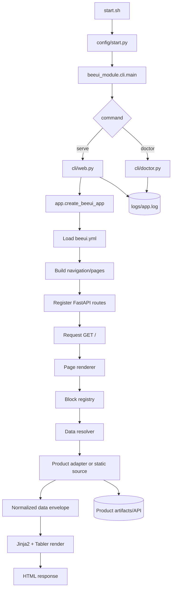
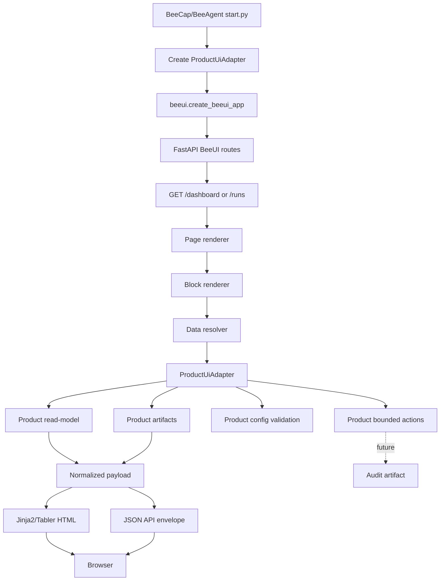
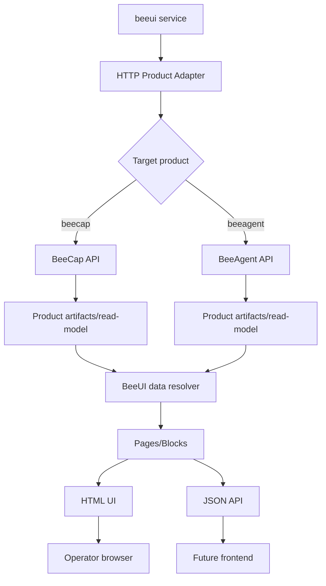

# ARCHITECTURE — схема модулей BeeUI (KISS)

## Идея

`beeui` — reusable UI/backend layer для Bee-продуктов.

Есть ядро `beeui` и подключаемые product adapters.

Ядро `beeui` ничего не знает о конкретной бизнес-логике `beecap`, `beeagent` или будущих Bee-продуктов. Оно работает через простой interface contract:

```text
ProductUiAdapter
  → dashboard read-model
  → runs read-model
  → artifacts read-model
  → config read-model / preview / apply callback
  → bounded actions callback
```

Главное правило:

```text
BeeUI renders.
Product decides.
```

`beeui` отвечает за:

- FastAPI app;
- Jinja2 templates;
- Tabler shell;
- navigation;
- pages;
- reusable blocks;
- artifact browser;
- JSON API envelopes;
- auth/session layer;
- admin/config/operator UI foundation;
- theme/customization.

Bee-продукт отвечает за:

- domain logic;
- runtime behavior;
- artifact contracts;
- config validation;
- action execution;
- authority/security boundaries.

## Поток данных (MVP)

1. `start.sh` запускает `config/start.py`.
2. `config/start.py` вызывает CLI command:
   - `doctor`;
   - `serve`;
   - later: integration/test commands.

3. `beeui_module.app.create_beeui_app(...)` создаёт FastAPI app.
4. BeeUI загружает `beeui.yml`.
5. BeeUI строит:
   - navigation;
   - pages;
   - layout rows;
   - block specs.

6. Page renderer запрашивает данные через `DataResolver`.
7. `DataResolver` обращается к одному из источников:
   - static JSON source;
   - in-memory demo source;
   - product adapter;
   - later: HTTP product API.

8. Block renderer получает normalized payload и рендерит Tabler/Jinja component:
   - metric card;
   - KPI grid;
   - status card;
   - table;
   - links;
   - artifact table;
   - chart card later.

9. HTML routes возвращают server-rendered UI.
10. JSON routes возвращают stable API envelope.
11. Artifact routes читают только allowlisted product artifacts через adapter.
12. Write/control routes, если включены в будущих итерациях, идут только через product-owned callbacks:

- preview;
- validate;
- apply;
- audit.

## Поток данных при embedded подключении к BeeCap/BeeAgent

### Embedded MVP

```text
beecap / beeagent process
  imports beeui
  creates ProductUiAdapter
  calls create_beeui_app(...)
  serves BeeUI routes
```

Пример:

```python
from beeui_module.app import create_beeui_app
from beecap_module.interfaces.ui.adapter import BeeCapUiAdapter

app = create_beeui_app(
    product_id="beecap",
    product_title="BeeCap",
    adapter=BeeCapUiAdapter(...),
    config_path="config/beeui.yml",
)
```

### Поток

1. Пользователь открывает `/`.
2. BeeUI находит page spec в `config/beeui.yml`.
3. Page renderer видит blocks.
4. Каждый block запрашивает данные через adapter.
5. `BeeCapUiAdapter` читает BeeCap artifacts/API/read-model.
6. BeeCap adapter возвращает normalized dict.
7. BeeUI рендерит HTML/API.
8. BeeUI не меняет BeeCap runtime state.

## Поток данных при standalone подключении

Standalone mode — future.

```text
beeui service
  → HTTP adapter
  → beecap API / beeagent API
```

MVP не должен начинаться со standalone mode, потому что это добавляет:

- CORS;
- service discovery;
- distributed auth;
- network failure modes;
- deployment complexity.

Решение:

```text
MVP: embedded.
Later: standalone.
```

## Модули

## core/

Базовые утилиты без web/product semantics.

- `paths.py` — пути проекта, logs, config, examples.
- `logging.py` — настройка логирования.
- `ids.py` — генерация безопасных идентификаторов.
- `json.py` — safe JSON/JSONL helpers.
- `security.py` — общие security helpers:
  - safe path checks;
  - identifier validation;
  - redaction helpers;
  - no-secrets serialization helpers.

## config.py / settings.py

- `config.py` — загрузка `beeui.yml`.
- `settings.py` — fail-fast validation schema.

Отвечают за:

- `app.title`;
- `app.product`;
- `theme`;
- `navigation`;
- `pages`;
- `blocks`;
- `data_sources`;
- future auth/config/action settings.

Правило:

```text
Invalid UI schema should fail fast.
Missing product data should degrade gracefully.
```

## app.py / server.py

- `app.py` — app factory:
  - `create_beeui_app(...)`;
  - `mount_beeui(...)`;
  - adapter injection;
  - template/static setup;
  - route registration.

- `server.py` — standalone/demo server runner.

MVP target:

```python
create_beeui_app(
    product_id: str,
    product_title: str,
    adapter: ProductUiAdapter,
    config_path: str | Path,
)
```

## pages/

Declarative page layer.

- `models.py` — `PageSpec`, `NavigationItem`, layout models.
- `registry.py` — page registration.
- `renderer.py` — page → blocks → template context.
- `router.py` — dynamic route registration from `beeui.yml`.

Responsibilities:

- build page layout;
- resolve active navigation item;
- render page title/subtitle;
- pass block specs to block registry;
- never contain product business logic.

## blocks/

Reusable UI block layer.

- `models.py` — `BlockSpec`, `BlockRenderContext`.
- `registry.py` — block type → renderer mapping.
- `renderers.py` — common rendering dispatcher.
- `types/` — concrete blocks:
  - `metric_card.py`;
  - `kpi_grid.py`;
  - `status_card.py`;
  - `table_card.py`;
  - `links_card.py`;
  - `artifact_table.py`;
  - `json_viewer.py`;
  - `chart_card.py`.

Block renderer должен знать только:

```text
block type
title
source
fields
value selectors
display options
empty/error state
```

Block renderer не должен знать:

```text
MRKT
Binance
ROP
Bitrix
capabilities
broker events
trading rules
```

Domain semantics приходят уже нормализованными через adapter/read-model.

## data/

Data resolution layer.

- `sources.py` — source definitions:
  - static;
  - memory;
  - adapter;
  - future HTTP.

- `resolver.py` — resolve source + selector.
- `selectors.py` — safe nested dict access.
- `envelopes.py` — stable data envelope.

Envelope:

```json
{
  "status": "ok",
  "data": {},
  "warnings": [],
  "source": {
    "type": "adapter",
    "name": "dashboard"
  }
}
```

Allowed statuses:

- `ok`;
- `partial`;
- `empty`;
- `degraded`;
- `error`.

## adapters/

Product integration layer.

- `base.py` — base protocol/interface.
- `product.py` — product adapter contracts.
- `filesystem.py` — safe filesystem adapter primitives.
- `http.py` — future HTTP product adapter.
- `beecap.py` — BeeCap adapter implementation/skeleton.
- `beeagent.py` — BeeAgent adapter implementation/skeleton.

Canonical interface:

```python
class ProductUiAdapter:
    product_id: str

    def get_dashboard(self) -> dict: ...
    def list_runs(self, filters: dict | None = None) -> list[dict]: ...
    def get_run(self, run_id: str) -> dict: ...
    def list_artifacts(self, run_id: str) -> list[dict]: ...
    def read_artifact(self, run_id: str, artifact_id: str) -> dict: ...

    def get_config_read_model(self) -> dict: ...
    def preview_config_change(self, changes: list[dict]) -> dict: ...
    def apply_config_change(self, changes: list[dict]) -> dict: ...

    def list_actions(self) -> list[dict]: ...
    def execute_action(self, action_id: str, payload: dict) -> dict: ...
```

MVP может реализовать только read-only subset:

```text
get_dashboard
list_runs
get_run
list_artifacts
read_artifact
```

## artifacts/

Generic artifact browser.

- `models.py` — artifact metadata model.
- `browser.py` — list/read artifact use cases.
- `readers.py` — JSON/JSONL/text readers.
- `safe_paths.py` — path traversal guard and allowlist helpers.

Rules:

- no arbitrary filesystem browsing;
- no direct path from query string to filesystem;
- artifact id must be resolved by product adapter;
- JSONL parse errors produce warnings, not app crash;
- secrets redaction before HTML/API output.

## api/

JSON API layer.

- `envelopes.py` — stable API response envelope.
- `routes.py` — API endpoints.

Envelope:

```json
{
  "ok": true,
  "status": "ok",
  "data": {},
  "warnings": [],
  "errors": [],
  "meta": {
    "api_version": "v1"
  }
}
```

Initial API routes:

- `GET /api/dashboard`;
- `GET /api/runs`;
- `GET /api/runs/{run_id}`;
- `GET /api/runs/{run_id}/artifacts`;
- `GET /api/runs/{run_id}/artifacts/{artifact_id}`;
- later:
  - `GET /api/config/read-model`;
  - `POST /api/config/preview`;
  - `POST /api/config/apply`;
  - `GET /api/actions`;
  - `POST /api/actions/{action_id}`.

## templates/

Jinja2 templates.

- `base.html` — base layout.
- `page.html` — generic page renderer.
- `login.html` — future auth.
- `error.html` — error page.
- `components/`:
  - `sidebar.html`;
  - `navbar.html`;
  - `page_header.html`;
  - `breadcrumbs.html`;
  - `alert.html`;
  - `badge.html`;
  - `metric_card.html`;
  - `kpi_card.html`;
  - `status_card.html`;
  - `data_table.html`;
  - `artifact_links.html`;
  - `json_viewer.html`;
  - `chart_card.html`.

Rules:

- templates are product-neutral;
- no BeeCap/BeeAgent hardcoded labels unless passed by adapter/config;
- HTML autoescape enabled;
- no inline secrets;
- no copied Tabler demo tracking code.

## static/

Static assets.

- `static/vendor/tabler/` — vendored Tabler compiled CSS/JS.
- `static/css/beeui.css` — BeeUI overrides and CSS variables.
- `static/js/beeui.js` — minimal UI helpers.

Rules:

- no CDN dependency by default;
- no tracking scripts;
- no product-specific CSS in core where avoidable;
- theme comes through config/CSS variables.

## theme/

Theme/customization layer.

- `models.py` — theme config.
- `service.py` — resolve theme.
- `css.py` — CSS variable generation.

Target config:

```yaml
app:
  theme:
    mode: dark
    primary: blue
    font: Inter
    radius: 2
    density: compact
```

Rules:

- controlled values only;
- no arbitrary CSS injection;
- product branding through schema, not template forks.

---

## config_ui/

Future bounded config UI.

- `read_model.py` — allowlisted config read-model.
- `preview.py` — in-memory validation preview.
- `apply.py` — bounded apply flow.
- `audit.py` — audit artifact writer.
- `routes.py` — HTML/API routes.

Rules:

- no arbitrary YAML editor;
- no secrets editing;
- product remains source of config validation;
- every apply attempt audited;
- backup before successful write.

## auth/

Future local auth/session layer.

- `models.py` — user/session models.
- `password.py` — password hashing.
- `sessions.py` — signed cookie/session handling.
- `permissions.py` — roles/permission checks.
- `service.py` — auth service.
- `routes.py` — login/logout.

Roles:

- `viewer`;
- `operator`;
- `admin`.

Rules:

- auth disabled only explicitly for local/dev;
- POST routes require CSRF once auth/write actions exist;
- no default admin password in repo;
- no plaintext password storage.

## cli/

CLI entrypoints.

- `main.py` — dispatch.
- `web.py` — start web server.
- `doctor.py` — diagnostics.

Initial commands:

```bash
./start.sh doctor
./start.sh web --host 127.0.0.1 --port 8780
```

Future commands:

```bash
./start.sh validate-config --config config/schema.yml
```

# Что такое “adapter” у нас

Adapter — это обычный Python class/module.

Без сложной plugin system.

Не используем на старте:

- dynamic entrypoints;
- auto-discovery;
- runtime pip installs;
- arbitrary external plugins.

MVP adapter подключается явно:

```python
create_beeui_app(adapter=BeeCapUiAdapter(...))
```

Это KISS и безопаснее.

# Что такое “block” у нас

Block — reusable rendering primitive.

Примеры:

- metric card;
- KPI grid;
- status card;
- table card;
- links card;
- artifact table;
- JSON viewer;
- chart card.

Block не знает domain semantics.
Domain semantics приходят как данные.

Пример:

```yaml
blocks:
  total_profit:
    type: metric_card
    title: Total Profit
    source: dashboard.profit
    value: total_profit
    suffix: USDT
```

# Что такое “page” у нас

Page — declarative layout.

Пример:

```yaml
pages:
  - id: dashboard
    path: /
    title: Dashboard
    layout:
      - row:
          - block: latest_run
            width: 3
          - block: runtime_status
            width: 3
          - block: active_orders
            width: 3
          - block: total_profit
            width: 3
```

Page не должна содержать Python business logic.

# Security boundaries

## Read-only by default

Все routes по умолчанию read-only.

Write/control routes появляются только явно:

- config apply;
- operator action;
- schema edit;
- future builder save.

## File/path safety

Запрещено:

- принимать raw path из URL и читать его напрямую;
- отдавать произвольные файлы из product repo;
- читать `.env`;
- читать secrets;
- читать файлы вне allowlist.

Разрешено:

- artifact id;
- adapter resolves artifact id to safe path;
- safe path checked against product storage root;
- output redacted.

## Product authority

`beeui` не имеет прямой authority:

- broker;
- trading runtime;
- agent execution;
- MCP execution;
- external provider calls.

Любые действия:

```text
BeeUI action form
  → product callback/API
  → product validation
  → product execution/denial
  → product audit/result
  → BeeUI renders result
```

# Mermaid-диаграмма — MVP



# Mermaid-диаграмма — Embedded BeeCap/BeeAgent



# Mermaid-диаграмма — Future standalone mode



# Runtime/package relationship

## Development layout

```text
~/Projects/
  beeui/
  beecap/
  beeagent/
```

`beeui` is independent repo.

`beecap` and `beeagent` can use local editable dependency during development:

```toml
dependencies = [
  "beeui @ file:///home/bee/Projects/beeui"
]
```

or:

```bash
uv pip install -e ../beeui
```

## Deployment MVP

Embedded deployment:

```text
container: beecap
  dependency: beeui
  serves BeeCap UI through BeeUI

container: beeagent
  dependency: beeui
  serves BeeAgent UI through BeeUI
```

## Deployment future

Standalone deployment:

```text
container: beeui
container: beecap-api
container: beeagent-api
```

Not MVP.

# Что не делаем сейчас

Не делаем в MVP:

- drag-and-drop builder;
- React frontend;
- standalone multi-product service;
- auth/RBAC;
- config write/apply;
- broker/action controls;
- arbitrary YAML editor;
- database index;
- websocket/SSE;
- plugin marketplace;
- external dynamic plugins.

Сначала:

```text
Tabler shell
declarative pages
block registry
data resolver
product adapter contract
BeeCap adapter
embedded mount
BeeCap dashboard parity
```

# Expected MVP definition

MVP считается достигнутым, если:

- `beeui` запускается как demo web app;
- pages/navigation задаются через `beeui.yml`;
- dashboard собирается из reusable blocks;
- data resolver работает;
- product adapter contract определён;
- BeeCap can render dashboard/run overview via BeeUI;
- BeeCap no longer needs to expand Tabler/Jinja templates manually;
- source artifacts remain canonical;
- routes are read-only;
- tests pass.

# Связанные документы

- `docs/ROADMAP.md` — итерации и этапы.
- `docs/SDLC.md` — process / PR / verification rules.
- `docs/SECURITY.md` — secure development rules.
- `docs/INTEGRATION.md` — как подключать BeeUI к BeeCap/BeeAgent.
- `docs/COMPONENTS.md` — block/component contract.
- `docs/API_CONTRACT.md` — JSON API envelopes and routes.
- `docs/WEB_UI.md` — HTML routes and web behavior.
- `docs/THEME.md` — theme/customization contract.
